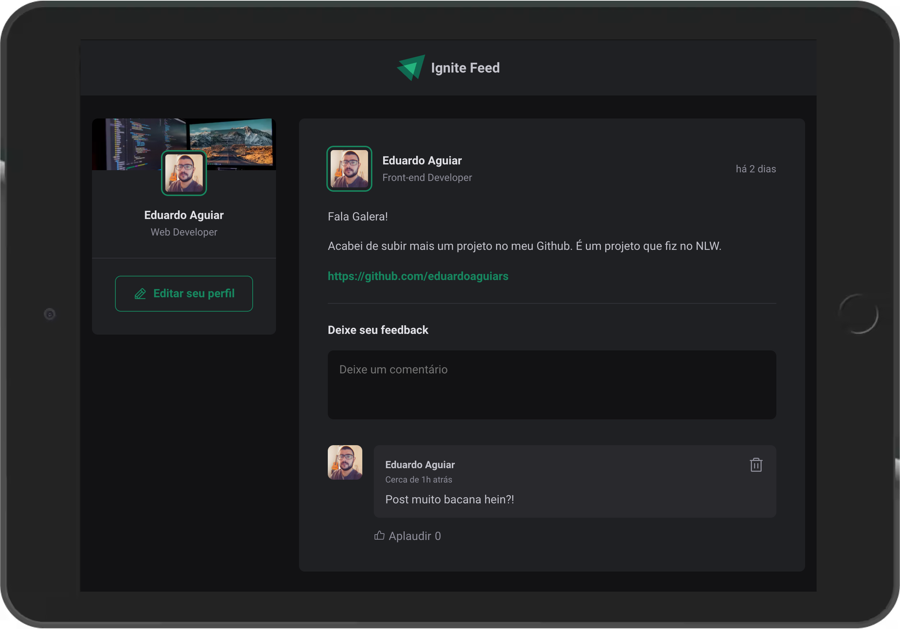
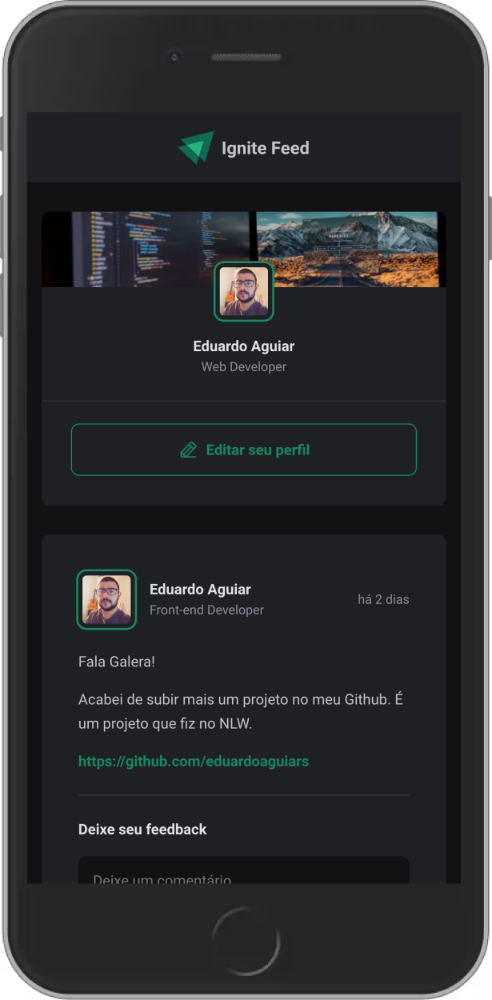

### Projeto Ignite Feed, desenvolvido na trilha de Fudamentos do ReactJS no curso de ReactJS no Ignite.

#### Tecnologias utilizadas:

- [`ViteJS`](https://vitejs.dev/)
- [`React`](https://reactjs.org)
- [`TypeScript`](https://www.typescriptlang.org/)

#### Projeto em desenvolvimento:

- [x] Iniciando com React
- [x] Estrutura da aplicação
- [x] Os motores do React
- [x] Aprimorando a aplicação

#### Como usar este projeto:

```bash
git clone https://github.com/EduardoAguiarS/ignite-feed
```

```bash
cd ignite-feed
```

```bash
yarn install
```

```bash
yarn dev
```

#### Projeto:




